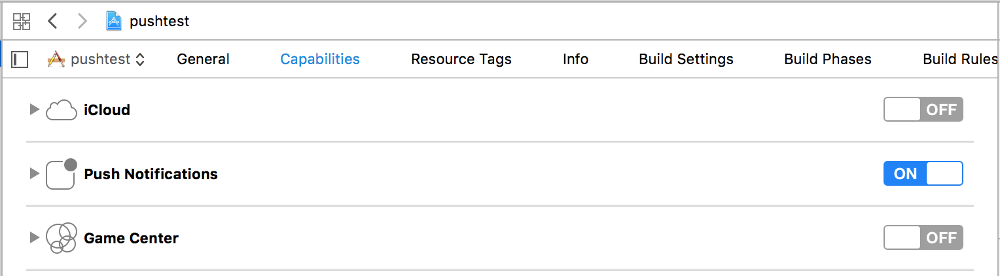
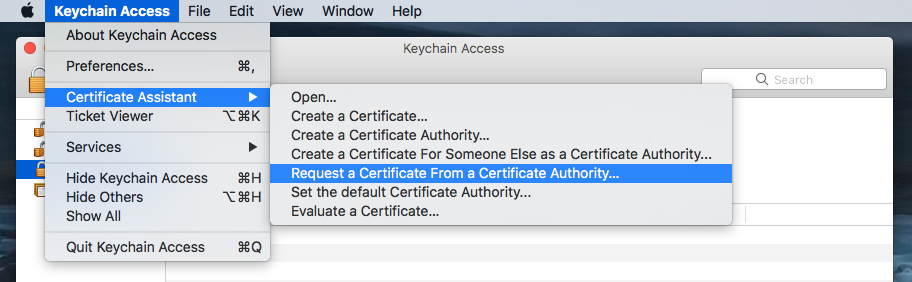
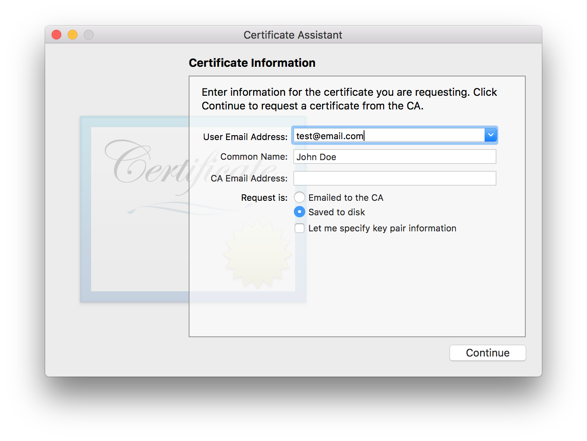
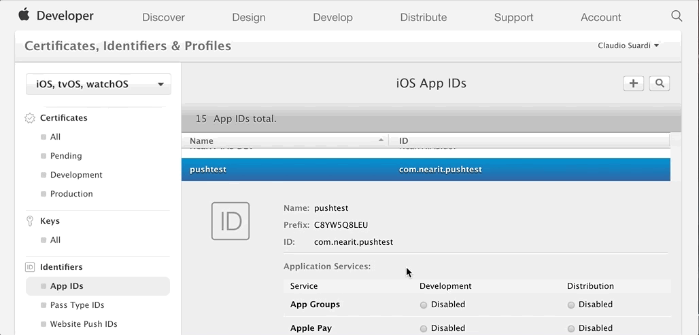
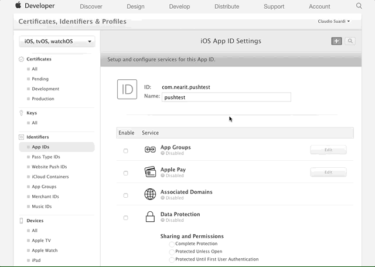
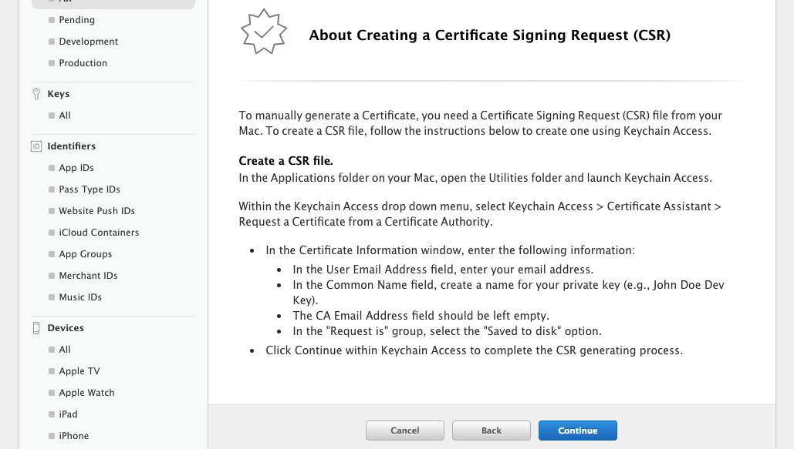
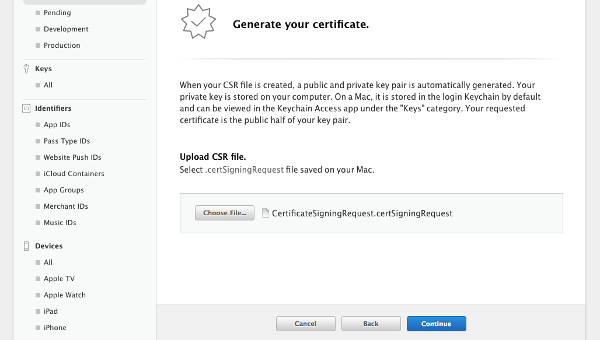
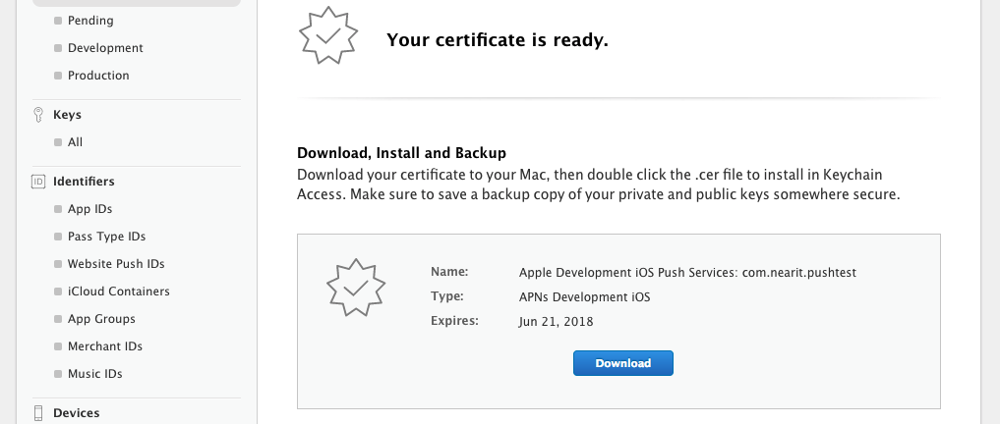
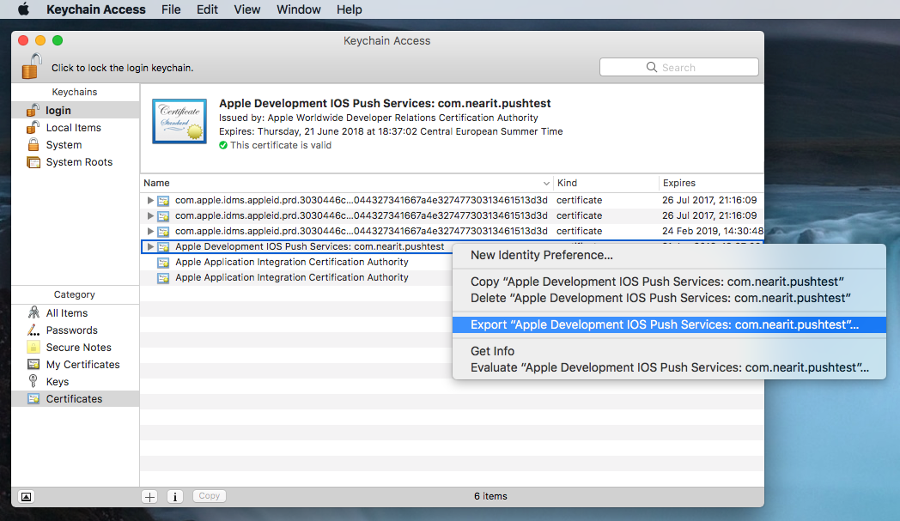

# Enable push capabilities

Inside Xcode, navigate to the “**Capabilities**” tab of your app. You will need to enable “**Push Notifications**”.

# Get Push Certificates

## 1) Generating a Certificate Request

1.1) Launch the “**Keychain Access**” app on your Mac.

1.2) Select “**Keychain Access> Certificate Assistant> Request a Certificate From a Certificate Authority**”.

1.3) Enter your e-mail, select “**Save to disk**” and press “**Continue**”. You should get a .certSigningRequest file.

## 2) Get the Certificate

2.1 Open [developer.apple.com](https://developer.apple.com/account/ios/identifier/bundle), select your app and press “**Edit**”.

2.2 Scroll down the page and enable Push Notifications. Press “**Create Certificate**”.

2.3 You should find yourself in the “Add iOS Certificate” wizard. Press “**Continue**”.

2.4 Press “**Choose File**” and upload the .certSigningRequest file you generated previously (chapter 1.3)

2.5 Your certificate is ready. Press “**Download**” to get the .cer file.

## 3) Upload a .p12 Key to NearIT

3.1 Click on the .cer certificate you generated previously (chapter 2.5). It will open the “**Keychain Access**” app on your mac.

3.2 Find your certificate, click on it and select “**Export**”. Enter a password, you will get a .p12 file.

3.3 Open [NearIT](https://go.nearit.com), select your app and navigate to “**Settings> Push Settings**”. Upload your .p12 under the “**Setup iOS push notifications**” block. You will be prompted to enter the password you have chosen previously (chapter 3.2)

