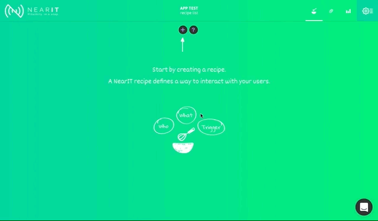

# Android push key setup

 
1. If you don't already have a **Firebase project**, create one at <a href="https://console.firebase.google.com/" target="_blank">**Google Firebase Console**</a>. 
Inside the project, select **"Add Firebase to your Android app"** (make sure to enter the right package name of your app).

 
2. Download `google-services.json` file to your computer and
copy it inside your Cordova project `resources/android` folder.

 
3. Copy your project ***FCM Cloud Messaging Server Key*** from <a href="https://console.firebase.google.com/" target="_blank">**Google Firebase Console**</a>

(See the screenshot below and make sure to use the right api key)

 
4. Open <a href="https://go.nearit.com/" target="_blank">**NearIT**</a>, select your app and navigate to **“Settings > Push Settings”**.
Paste your project FCM Key under the **“Setup Android push notifications”** block.

