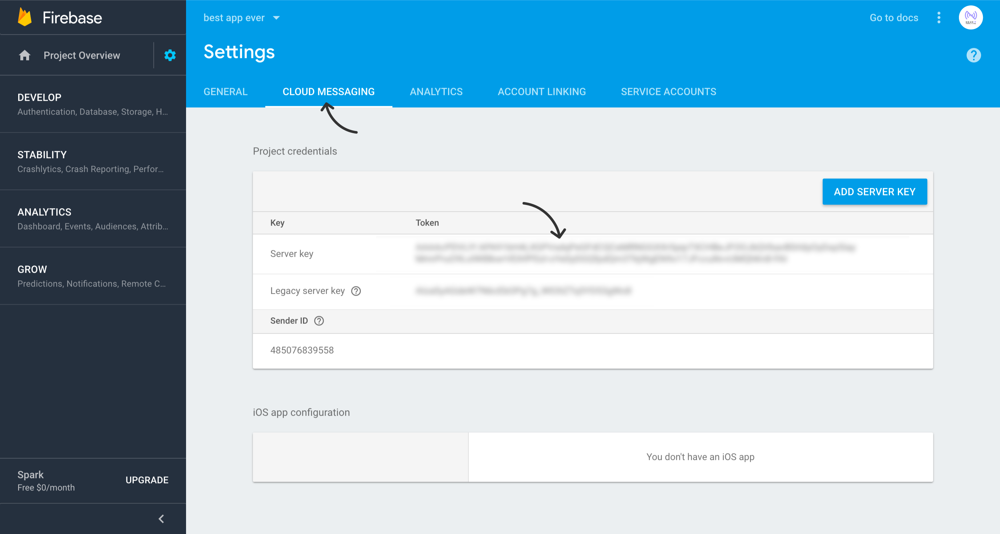

# Create a Firebase Project
If you don't already have a Firebase project, create one at [Google Firebase Console](https://console.firebase.google.com/).

1. After the project is ready, download `google-services.json` file to your computer and
copy it inside your Cordova project `resources/android` folder.

 
2. Copy your project ***FCM Cloud Messaging Server Key*** from [Google Firebase Console](https://console.firebase.google.com/)

(See the screenshot below and make sure to use the right api key)

 
3. Open [NearIT](https://go.nearit.com), select your app and navigate to **“Settings > Push Settings”**.
Paste your project FCM Key under the **“Setup Android push notifications”** block.

